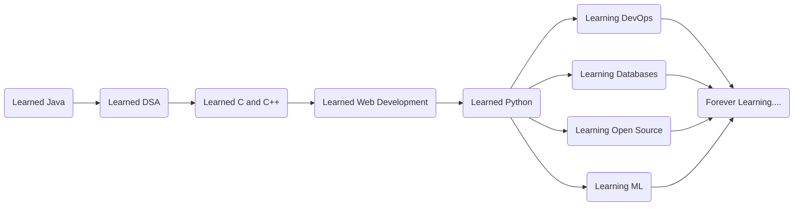
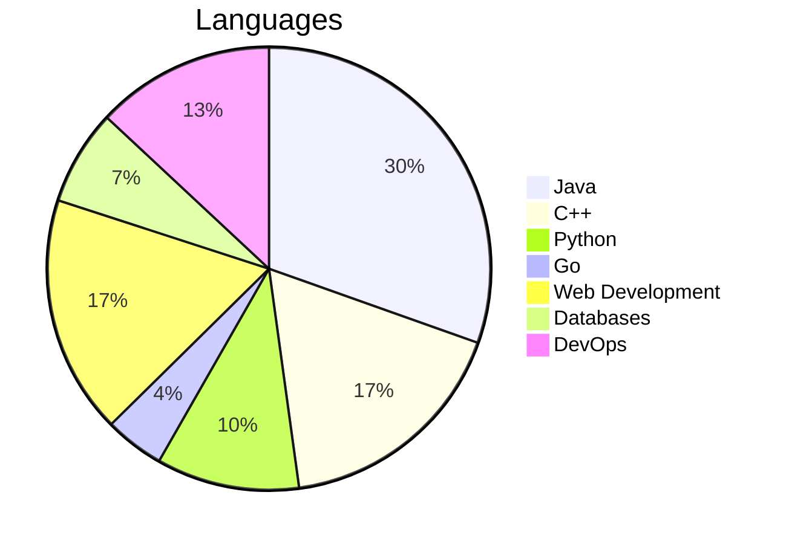

# Read Me 👇

## Social

## Journey

## Skills

## Contributions
Just stared with Contribution to the Open Source. 
[100DaysOfKubernetes](https://100daysofkubernetes.io/overview.html).

## Blogs
This are the blogs in my hashnode account.  
[Touch Typing](https://codago.hashnode.dev/touch-typing-learn-to-type-faster).
[Docker](https://codago.hashnode.dev/docker).
[Problem Solving](https://codago.hashnode.dev/problem-solving-think-apply-and-build).

